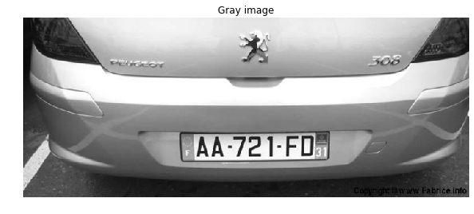

    import numpy as np
    import matplotlib.pyplot as plt
    %matplotlib inline
    from PIL import Image
    import lmdb
    import caffe

    plt.rcParams['figure.figsize'] = (1, 1)
    plt.rcParams['image.interpolation'] = 'nearest'
    plt.rcParams['image.cmap'] = 'gray'

# Have a look a the training data

    env = lmdb.open('test_lmdb')
    t = ['A','B','C','D','E','F','G','H','I','J','K','L','M','N','O','P','Q','R','S','T','U','V','W','X','Y','Z','0','1','2','3','4','5','6','7','8','9'];
    
    def get(k):
        with env.begin() as txn:
            raw_datum = txn.get(k)
    
        datum = caffe.proto.caffe_pb2.Datum()
        datum.ParseFromString(raw_datum)
        flat_x = np.fromstring(datum.data, dtype=np.uint8)
        x = flat_x.reshape(datum.channels, datum.height, datum.width)
        y = datum.label
        plt.imshow(x[0,...],cmap='gray')
        plt.show()
        print t[y]
    
    get(b'00000006')
    get(b'00000009')

    D

    5

# Test the network for classification

    caffe.set_mode_cpu()
    net = caffe.Net('lenet_train_test_withoutdata.prototxt','lenet_iter_2000.caffemodel',caffe.TEST)

    print("blobs {}\nparams {}".format(net.blobs.keys(), net.params.keys()))

    blobs ['data', 'conv1', 'pool1', 'conv2', 'pool2', 'dropout', 'ip1', 'ip2-alpha']
    params ['conv1', 'conv2', 'ip1', 'ip2-alpha']

    im = np.array(Image.open('input/8.png'))
    plt.title("original image")
    plt.imshow(im)
    plt.axis('off')

    (-0.5, 27.5, 27.5, -0.5)

    im.shape
    im_input = im[np.newaxis, np.newaxis, :, :]
    net.blobs['data'].reshape(*im_input.shape)
    net.blobs['data'].data[...] = im_input

    plt.rcParams['figure.figsize'] = (10, 10)
    out = net.forward()
    plt.figure()
    filt_min, filt_max = net.blobs['conv1'].data.min(), net.blobs['conv1'].data.max()
    for i in range(9):
        plt.subplot(1,10,i+2)
        plt.title("filter #{} output".format(i))
        plt.imshow(net.blobs['conv1'].data[0, i], vmin=filt_min, vmax=filt_max)
    print("The result is {}".format(t[out['ip2-alpha'].argmax()]))

    The result is B

#Feature map
Let's cast the Innerproducts layer 'ip1' and 'ip2-alpha' into convolution layers 'ip1-conv' and 'ip2-alpha-conv'

    !diff lenet_train_test_withoutdata.prototxt lenet_train_test_featuremap.prototxt

    1c1
    < name: "LeNet"
    ---
    > name: "LeNetConv"
    82,83c82,83
    <   name: "ip1"
    <   type: "InnerProduct"
    ---
    >   name: "ip1-conv"
    >   type: "Convolution"
    85,92c85,86
    <   top: "ip1"
    <   param {
    <     lr_mult: 1
    <   }
    <   param {
    <     lr_mult: 2
    <   }
    <   inner_product_param {
    ---
    >   top: "ip1-conv"
    >   convolution_param {
    94,99c88
    <     weight_filler {
    <       type: "xavier"
    <     }
    <     bias_filler {
    <       type: "constant"
    <     }
    ---
    >     kernel_size: 1
    105,106c94,95
    <   bottom: "ip1"
    <   top: "ip1"
    ---
    >   bottom: "ip1-conv"
    >   top: "ip1-conv"
    109,119c98,102
    <   name: "ip2-alpha"
    <   type: "InnerProduct"
    <   bottom: "ip1"
    <   top: "ip2-alpha"
    <   param {
    <     lr_mult: 1
    <   }
    <   param {
    <     lr_mult: 2
    <   }
    <   inner_product_param {
    ---
    >   name: "ip2-alpha-conv"
    >   type: "Convolution"
    >   bottom: "ip1-conv"
    >   top: "ip2-alpha-conv"
    >   convolution_param {
    121,126c104
    <     weight_filler {
    <       type: "xavier"
    <     }
    <     bias_filler {
    <       type: "constant"
    <     }
    ---
    >     kernel_size: 1

    params = ['ip1', 'ip2-alpha']
    # fc_params = {name: (weights, biases)}
    fc_params = {pr: (net.params[pr][0].data, net.params[pr][1].data) for pr in params}
    
    for fc in params:
        print '{} weights are {} dimensional and biases are {} dimensional'.format(fc, fc_params[fc][0].shape, fc_params[fc][1].shape)

    ip1 weights are (500, 800) dimensional and biases are (500,) dimensional
    ip2-alpha weights are (36, 500) dimensional and biases are (36,) dimensional

    # Load the fully convolutional network to transplant the parameters.
    net_full_conv = caffe.Net('lenet_train_test_featuremap.prototxt','lenet_iter_2000.caffemodel',caffe.TEST)
    params_full_conv = ['ip1-conv', 'ip2-alpha-conv']
    # conv_params = {name: (weights, biases)}
    conv_params = {pr: (net_full_conv.params[pr][0].data, net_full_conv.params[pr][1].data) for pr in params_full_conv}
    
    for conv in params_full_conv:
        print '{} weights are {} dimensional and biases are {} dimensional'.format(conv, conv_params[conv][0].shape, conv_params[conv][1].shape)

    ip1-conv weights are (500, 50, 1, 1) dimensional and biases are (500,) dimensional
    ip2-alpha-conv weights are (36, 500, 1, 1) dimensional and biases are (36,) dimensional

    for pr, pr_conv in zip(params, params_full_conv):
        conv_params[pr_conv][0].flat = fc_params[pr][0].flat  # flat unrolls the arrays
        conv_params[pr_conv][1][...] = fc_params[pr][1]

    net_full_conv.save('lenet_train_test__full_conv.caffemodel')

    plt.rcParams['figure.figsize'] = (10, 5)
    im = np.array(Image.open('input/p1.jpg'))
    plt.title("original image")
    plt.imshow(im)
    plt.axis('off')
    im.shape

    (322, 800, 3)

    import cv2
    im_gray = cv2.cvtColor(im,cv2.COLOR_BGR2GRAY)
    im_gray = cv2.resize(im_gray,None, fx=0.9, fy=0.9, interpolation = cv2.INTER_AREA)
    plt.title("Gray image")
    plt.imshow(im_gray)
    plt.axis('off')
    im_gray.shape

    (290, 720)

    im_input = im_gray[np.newaxis, np.newaxis, :, :]
    net_full_conv.blobs['data'].reshape(*im_input.shape)
    net_full_conv.blobs['data'].data[...] = im_input

    out = net_full_conv.forward()
    out['ip2-alpha-conv'].shape

    (1, 36, 70, 177)

    # show net input and confidence map (probability of the top prediction at each location)
    plt.subplot(1, 2, 1)
    plt.imshow(net_full_conv.blobs['data'].data[0,0])
    plt.subplot(1, 2, 2)
    plt.imshow(out['ip2-alpha-conv'][0,0] )

    <matplotlib.image.AxesImage at 0x1172c4d90>

    
